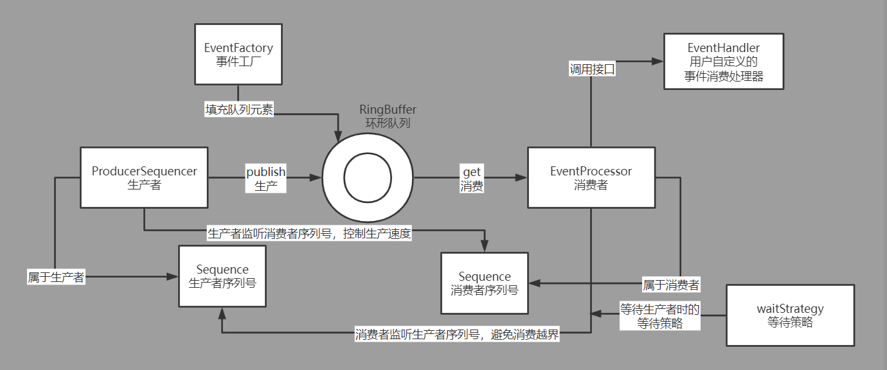

# 1.lmax-Disruptor队列介绍
disruptor是英国著名的金融交易所lmax旗下技术团队开发的一款java实现的高性能内存队列框架。
其发明disruptor的主要目的是为了改进传统的内存队列实现如jdk的ArrayBlockingQueue、LinkedBlockingQueue等在现代CPU硬件上的一些缺陷.
##### 1. 伪共享问题 
   现代的CPU都是多核的，每个核心都拥有独立的高速缓存。高速缓存由固定大小的缓存行组成（通常为32个字节或64个字节）。
   CPU以缓存行作为最小单位读写，且一个缓存行通常会被多个变量占据（例如32位的引用指针占4字节，64位的引用指针占8个字节）。  
   这样的设计导致了一个问题：即使缓存行上的变量是无关联的（比如不属于同一个对象），但只要缓存行上的某一个共享变量发生了变化，则整个缓存行都会进行缓存一致性的同步。 
   而CPU间缓存一致性的同步是有一定性能损耗的，能避免则尽量避免。这就是所谓的“**伪共享**”问题。  
   disruptor通过对队列中一些关键变量进行了缓存行的填充，避免其因为不相干的变量读写而无谓的刷新缓存，解决了伪共享的问题。  
   关于CPU间缓存一致性相关的内容可以参考下我以前的博客：
   [高速缓存一致性协议MESI与内存屏障](https://www.cnblogs.com/xiaoxiongcanguan/p/13184801.html)
##### 2. 队头、队尾引用等共享变量过多的的争抢
   传统的内存队列由于生产者、消费者都会并发的读写队列头、队列尾的引用和更新队列size， 
   因此被迫使用了如ReentrantLock等基于上下文切换的悲观锁或是CAS机制的乐观锁等互斥机制来保证队列关键数据的并发安全，
   但即使是CAS这样非阻塞的机制，由于存在失败重试机制，其性能损耗在追求极限性能的高并发队列中间件上也是不容忽视的  
   disruptor在实现过程中巧妙的通过全局有序增长的序列号机制代替了显式地队列头、队列尾更新，极大的减少了需要并发更新共享变量的场合，从而提高了高并发场景下队列的吞吐量
##### 3. 入队、出队时队列元素产生大量垃圾
   juc包下的阻塞队列队列元素会在入队时被创建、出队被消费后就不再被引用而产生大量的垃圾。 
   disruptor通过基于数组的环形队列，在开始运行前用空的事件对象填充好整个队列，后续的生产与消费则不新增或者删除队列元素，而是配合序列号机制，修改队列元素中的属性进行生产者和消费者的交互。
   通过固定队列中的对象，disruptor避免了入队、出队时产生不必要的垃圾。  
##### 
   除此之外，disruptor还允许设置消费者间消费的依赖关系（例如A、B消费者消费完毕后，C才能消费），构造高效的事件传输管道，实现1对1，1对多，多对1等模式的组合。   
   更详细的内容可以参考disruptor的官方文档：https://lmax-exchange.github.io/disruptor/disruptor.html  
   上面虽然介绍了有关disruptor的各种特点，但只有详细的研究源码后才能更好地理解disruptor的原理，体会其整体设计思路以及代码层面微观实现的精妙之处。
# 2.MyDisruptor介绍
编程和画画很类似，比起对着已经完工的画作进行分析，我更喜欢参考着原画从设计者的角度出发自己临摹出一副属于自己的画。
在这个过程中，可以看到程序从简单到复杂的全过程，能更清楚得知道哪些是核心功能而哪些是相对边缘的逻辑，从而获得一条平滑的学习曲线。  
MyDisruptor就是我按照上述学习方式自己临摹出来的结果，按照功能模块大致分为六个迭代版本逐步完成，最终实现一个和disruptor相差无几的队列。
在这个过程中，低版本的代码很精简，可以让读者更容易理解当前功能的实现原理，而不会被其余旁路代码的复杂度给绕晕。
1. ringBuffer + 单线程生产者 + 单线程消费者
2. 多线程消费者 + 消费者组依赖关系（A/B -> C, AB消费成功后C才能消费）
3. worker线程组消费者
4. 多线程生产者
5. disruptor dsl(提供简单易用的接口，屏蔽掉人工组装依赖链的复杂度)
6. ringBuffer等关键组件解决伪共享问题 + 参考disruptor对特定的数据结构做进一步优化
# 3.MyDisruptor v1版本详细解析
v1版本是整个项目的地基，所以在这里先介绍disruptor的核心设计思想和各关键组件的整体关联以帮助大家更好地理解。
## 3.1 disruptor核心设计思想
### volatile + 并发写变量的分离
我们知道基于阻塞/唤醒的悲观锁和基于CAS的乐观锁都是并发编程中常见地同步机制，但是其在高并发场景下都有一定的性能损耗。那么有没有开销更低地线程间同步机制呢？
答案是有，既java中volatile修饰符提供地多线程间的内存可见性能力。  
java中volatile修饰的变量具备多线程间的可见性能力，但不提供原子性更新的功能，所以不是线程安全的。这段概述是不全面的，确实在多线程并发读写时，由于缺少原子性更新机制
单靠volatile是无法做到线程安全的，但在**单写者多读者**这一更为特殊的场景下，仅靠volatile提供的内存可见性能力就可以做到并发场景下的线程安全，且其性能开销会更低。
### 一写多读的序列号机制
disruptor从设计一开始就引入了单调递增的序列号机制，每个生产者、消费者线程都有自己独立所属的序列号变量（volatile修饰），其只能由拥有者写入，其它线程只能去读取，做到一写多读。 
* 生产者和消费者通过写自己独占的序列号，读其它线程序列号的方式进行通信
* 序列号对队列长度取模，可以得到其在环形队列中的实际下标位置
* 生产者每进行一次生产发布，生产者序列号就加1；消费者每进行一次消费，消费者序列号也加1。消费者的序列号永远不能超过生产者
* 当生产者的序列号超过消费者时，说明当前生产速度超过了消费速度；当生产者超过最慢消费者的序列之差和队列容量相等时，需要阻塞生产者，等待消费者消费（逻辑上等于队列已满）
* 反之，当消费者的序列号即将超过生产者时（临界状态恰好等于），则需要阻塞当前消费者，等待生产者生产（逻辑上等于队列为空）
* 在消费者间存在依赖的场景下，不同于消费者间通过传递队列元素对象来实现依赖关系。当前消费者除了需要关注生产者的序列号，也关注其依赖的上游消费者。使自己的序列号始终不超过上游消费者的序列号，巧妙地实现依赖关系。
#####
disruptor拆分了传统队列中多写多读的队列头、尾等多读多写的变量，仅凭借内存可见性就完成了生产者和消费者间的通信
### disruptor简要架构图
!
下面我们基于源码分析MyDisruptor，MyDisruptor内各个组件都在disruptor对应组件名称的基础上加了My前缀以作区分。
## 3.2 MyDisruptor核心组件解析
### MySequence序列号对象
* 序列号Sequence是disruptor实现生产者、消费者间互相通信的关键，因此在Sequence内部有一个volatile修饰的long变量value（long类型足够大，可以不用考虑溢出），用于标识单调递增的序列号。  
* 为了在特定的场景下避免对volatile变量更新时不必要的刷新CPU缓存，通过unsafe的putOrderedLong方法来优化性能（具体用到的地方会在后面章节中展开）。  
* putOrderedLong操作在实际更新前会插入store-store屏障（保证与之前发生的写操作的有序性，不会重排序导致乱序），比起对volatile修饰的value=xxx时设置的store-load屏障性能要好一些。
其带来的后果就是putOrderedLong更新后，不会立即强制CPU刷新缓存数据到主内存中，导致其修改的最新值对其它CPU核心（其它线程）来说不是立即可见的（延迟在纳秒级别）。
```java
/**
 * 序列号对象（仿Disruptor.Sequence）
 * 由于需要被生产者、消费者线程同时访问，因此内部是一个volatile修饰的long值
 * */
public class MySequence {

    /**
     * 序列起始值默认为-1，保证下一序列恰好是0（即第一个合法的序列号）
     * */
    private volatile long value = -1;

    private static final Unsafe UNSAFE;
    private static final long VALUE_OFFSET;

    static {
        try {
            // 由于提供给cas内存中字段偏移量的unsafe类只能在被jdk信任的类中直接使用，这里使用反射来绕过这一限制
            Field getUnsafe = Unsafe.class.getDeclaredField("theUnsafe");
            getUnsafe.setAccessible(true);
            UNSAFE = (Unsafe) getUnsafe.get(null);
            VALUE_OFFSET = UNSAFE.objectFieldOffset(MySequence.class.getDeclaredField("value"));
        }
        catch (final Exception e) {
            throw new RuntimeException(e);
        }
    }

    public MySequence() {
    }

    public MySequence(long value) {
        this.value = value;
    }

    public long get() {
        return value;
    }

    public void set(long value) {
        this.value = value;
    }

    public void lazySet(long value) {
        UNSAFE.putOrderedLong(this, VALUE_OFFSET, value);
    }
}
```
看完MySequence的实现后你可能会有一个疑问，这不就是一个简易版的AtomicLong吗，为什么disruptor还要自己造一个出来呢？  
确实在v1版本中，Sequence类比起juc的AtomicLong只是名字上更加贴合业务而已，能被AtomicLong完全的代替。
但Disruptor通过填充多余的字段解决了Sequence中value变量的伪共享问题，MyDisruptor中伪共享的实现放在了后面的版本，所以v1版本在这里提前进行了抽象，目的是方便大家后续的理解。
### MySingleProducerSequencer单线程生产者
* disruptor中生产者的发布是分为两个阶段的，一阶段根据next方法获得可用的1个或者多个连续的序列号准备发布（可以理解为获得了存放货品的权限，但还没把货品实际上架），
根据序列号更新队列中下标对应的事件对象；二阶段通过publish方法更新生产者序列号进行实际发布，令新生产的动作可以被消费者感知到。
* 生产者内部维护了消费者的序列号对象。next方法获取可用的序列号时需要避免消费者的序列号落后所要申请的最大序列号一圈。 
  因为在逻辑上消费者序列对应的位置可以视为队列头，而生产者序列对应的位置可以视为队列尾，当队列尾与队列头之差超过了队列本身长度时，就说明逻辑上队列已满。
  此时生产者应该阻塞等待消费者，否则生产者将会覆盖还未被消费者确认消费完成的事件。  
  
<details>
  <summary>MySingleProducerSequencer实现</summary>
  <pre><code>
/**
 * 单线程生产者序列器（仿Disruptor.SingleProducerSequencer）
 * 只支持单消费者的简易版本（只有一个consumerSequence）
 *
 * 因为是单线程序列器，因此在设计上就是线程不安全的
 * */
public class MySingleProducerSequencer {

    /**
     * 生产者序列器所属ringBuffer的大小
     * */
    private final int ringBufferSize;

    /**
     * 当前已发布的生产者序列号
     * （区别于nextValue）
     * */
    private final MySequence currentProducerSequence = new MySequence();

    /**
     * 生产者序列器所属ringBuffer的消费者的序列
     * */
    private MySequence consumerSequence;

    private final MyWaitStrategy myWaitStrategy;

    /**
     * 当前已申请的序列(但是是否发布了，要看currentProducerSequence)
     * 单线程生产者内部使用，所以就是普通的long，不考虑并发
     * */
    private long nextValue = -1;

    /**
     * 当前已缓存的消费者序列
     * 单线程生产者内部使用，所以就是普通的long，不考虑并发
     * */
    private long cachedConsumerSequenceValue = -1;

    public MySingleProducerSequencer(int ringBufferSize, MyWaitStrategy myWaitStrategy) {
        this.ringBufferSize = ringBufferSize;
        this.myWaitStrategy = myWaitStrategy;
    }

    /**
     * 申请可用的1个生产者序列号
     * */
    public long next(){
        return next(1);
    }

    /**
     * 一次性申请可用的n个生产者序列号
     * */
    public long next(int n){
        // 申请的下一个生产者位点
        long nextProducerSequence = this.nextValue + n;
        // 新申请的位点下，生产者恰好超过消费者一圈的环绕临界点序列
        long wrapPoint = nextProducerSequence - this.ringBufferSize;

        // 获得当前已缓存的消费者位点
        long cachedGatingSequence = this.cachedConsumerSequenceValue;

        // 消费者位点cachedValue并不是实时获取的（因为在没有超过环绕点一圈时，生产者是可以放心生产的）
        // 每次发布都实时获取反而会触发对消费者sequence强一致的读，迫使消费者线程所在的CPU刷新缓存（而这是不需要的）
        if(wrapPoint > cachedGatingSequence){
            // 比起disruptor省略了if中的cachedGatingSequence > nextProducerSequence逻辑
            // 原因请见：https://github.com/LMAX-Exchange/disruptor/issues/76

            // 比起disruptor省略了currentProducerSequence.set(nextProducerSequence);
            // 原因请见：https://github.com/LMAX-Exchange/disruptor/issues/291
            long minSequence;

            // 当生产者发现确实当前已经超过了一圈，则必须去读最新的消费者序列了，看看消费者的消费进度是否推进了
            // 这里的consumerSequence.get是对volatile变量的读，是实时的、强一致的读
            while(wrapPoint > (minSequence = consumerSequence.get())){
                // 如果确实超过了一圈，则生产者无法获取可用的队列空间，循环的间歇性park阻塞
                LockSupport.parkNanos(1L);
            }

            // 满足条件了，则缓存获得最新的消费者序列
            // 因为不是实时获取消费者序列，可能cachedValue比上一次的值要大很多
            // 这种情况下，待到下一次next申请时就可以不用去强一致的读consumerSequence了
            this.cachedConsumerSequenceValue = minSequence;
        }

        // 记录本次申请后的，已申请的生产者位点
        this.nextValue = nextProducerSequence;

        return nextProducerSequence;
    }

    public void publish(long publishIndex){
        // 发布时，更新生产者队列
        // lazySet，由于消费者可以批量的拉取数据，所以不必每次发布时都volatile的更新，允许消费者晚一点感知到，这样性能会更好
        // 设置写屏障
        this.currentProducerSequence.lazySet(publishIndex);

        // 发布完成后，唤醒可能阻塞等待的消费者线程
        this.myWaitStrategy.signalWhenBlocking();
    }

    public MySequenceBarrier newBarrier(){
        return new MySequenceBarrier(this.currentProducerSequence,this.myWaitStrategy);
    }

    public void setConsumerSequence(MySequence consumerSequence){
        this.consumerSequence = consumerSequence;
    }

    public int getRingBufferSize() {
        return ringBufferSize;
    }
}
</code></pre>
</details>  

##### 生产者自旋性能隐患
上述MySingleProducerSequencer的实现中，生产者是通过park(1L)自旋来等待消费者的。如果消费者消费速度比较慢，那么生产者线程将长时间的处于自旋状态，严重浪费CPU资源。因此使用next方式获取生产者序列号时，用户必须保证消费者有足够的消费速度。  
disruptor和juc下很多并发工具类一样，除了提供内部自动阻塞的next方法外，还提供了tryNext方法。tryNext在消费者速度偏慢无法获得可用的生产序列时直接抛出特定的异常，用户在捕获异常后可以灵活的控制重试的间隔。tryNext方法原理和next是相同的，限于篇幅在v1版本中就不先实现该方法了。
### MyRingBuffer环形队列
### MyBatchEventProcessor单线程消费者
### MyDisruptor使用Demo分析
# 总结
