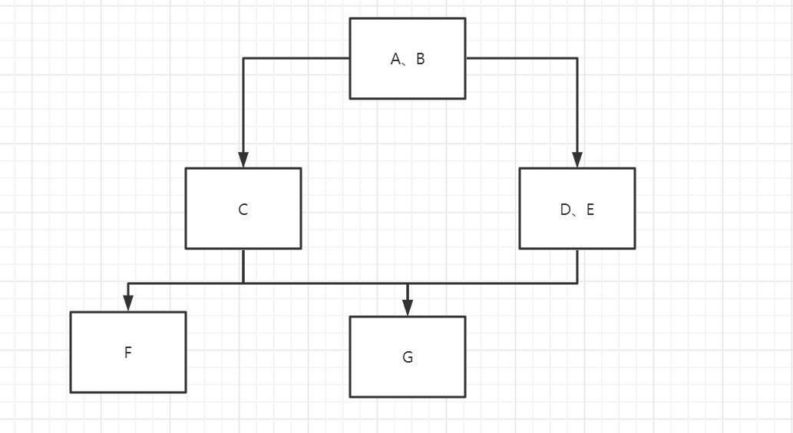

# MyDisruptor V2版本介绍
在v1版本搭建好disruptor的地基，实现单生产者、单消费者后，按照既定计划，v2版本的MyDisruptor需要支持多消费者和允许设置消费者组间的依赖关系。
v1版本解析的博客可以参考：lab1_blog.md
# MyDisruptor支持多消费者
* disruptor中的生产者和消费者是互相制约的，生产者的生产速度不能过快，在逻辑上队列已满时需要阻塞等待消费者进行消费，直到队列不满。  
* 而要支持多消费者，上述描述需要做一定的调整：即生产者的生产速度不能过快，在逻辑上队列已满时需要阻塞等待”**最慢的消费者**“完成消费，直到队列不满。  
* disruptor中每个消费者都拥有自己的消费序列号，生产者在生产时需要保证生产的序列号不能覆盖任何一个消费者，即生产者的序列号不能超过最慢的消费者序列号一圈（Producer.Sequence - SlowestConsumer.Sequence <= ringBufferSize）  
所以生产者需要维护一个消费者序列集合，在生产者生产时控制生产速度避免超过最慢的消费者而发生越界。
##### v2版本单线程生产者实现
```java
package mydisruptor;

import mydisruptor.util.SequenceUtil;
import mydisruptor.waitstrategy.MyWaitStrategy;

import java.util.ArrayList;
import java.util.Arrays;
import java.util.List;
import java.util.concurrent.locks.LockSupport;

/**
 * 单线程生产者序列器（仿Disruptor.SingleProducerSequencer）
 * 只支持单消费者的简易版本（只有一个consumerSequence）
 *
 * 因为是单线程序列器，因此在设计上就是线程不安全的
 * */
public class MySingleProducerSequencer {

    /**
     * 生产者序列器所属ringBuffer的大小
     * */
    private final int ringBufferSize;

    /**
     * 当前已发布的生产者序列号
     * （区别于nextValue）
     * */
    private final MySequence currentProducerSequence = new MySequence();

    /**
     * 生产者序列器所属ringBuffer的消费者序列集合
     * （v2版本简单起见，先不和disruptor一样用数组+unsafe来实现）
     * */
    private final List<MySequence> gatingConsumerSequenceList = new ArrayList<>();

    private final MyWaitStrategy myWaitStrategy;

    /**
     * 当前已申请的序列(但是是否发布了，要看currentProducerSequence)
     *
     * 单线程生产者内部使用，所以就是普通的long，不考虑并发
     * */
    private long nextValue = -1;

    /**
     * 当前已缓存的消费者序列
     *
     * 单线程生产者内部使用，所以就是普通的long，不考虑并发
     * */
    private long cachedConsumerSequenceValue = -1;

    public MySingleProducerSequencer(int ringBufferSize, MyWaitStrategy myWaitStrategy) {
        this.ringBufferSize = ringBufferSize;
        this.myWaitStrategy = myWaitStrategy;
    }

    /**
     * 一次性申请可用的1个生产者序列号
     * */
    public long next(){
        return next(1);
    }

    /**
     * 一次性申请可用的n个生产者序列号
     * */
    public long next(int n){
        // 申请的下一个生产者位点
        long nextProducerSequence = this.nextValue + n;
        // 新申请的位点下，生产者恰好超过消费者一圈的环绕临界点序列
        long wrapPoint = nextProducerSequence - this.ringBufferSize;

        // 获得当前已缓存的消费者位点
        long cachedGatingSequence = this.cachedConsumerSequenceValue;

        // 消费者位点cachedValue并不是实时获取的（因为在没有超过环绕点一圈时，生产者是可以放心生产的）
        // 每次发布都实时获取反而会触发对消费者sequence强一致的读，迫使消费者线程所在的CPU刷新缓存（而这是不需要的）
        if(wrapPoint > cachedGatingSequence){
            // 比起disruptor省略了if中的cachedGatingSequence > nextProducerSequence逻辑
            // 原因请见：https://github.com/LMAX-Exchange/disruptor/issues/76

            // 比起disruptor省略了currentProducerSequence.set(nextProducerSequence);
            // 原因请见：https://github.com/LMAX-Exchange/disruptor/issues/291
            long minSequence;

            // 当生产者发现确实当前已经超过了一圈，则必须去读最新的消费者序列了，看看消费者的消费进度是否推进了
            // 这里的getMinimumSequence方法中是对volatile变量的读，是实时的、强一致的读
            while(wrapPoint > (minSequence = SequenceUtil.getMinimumSequence(nextProducerSequence, gatingConsumerSequenceList))){
                // 如果确实超过了一圈，则生产者无法获取可用的队列空间，循环的间歇性park阻塞
                LockSupport.parkNanos(1L);
            }

            // 满足条件了，则缓存获得最新的消费者序列
            // 因为不是实时获取消费者序列，可能cachedValue比上一次的值要大很多
            // 这种情况下，待到下一次next申请时就可以不用去强一致的读consumerSequence了
            this.cachedConsumerSequenceValue = minSequence;
        }

        // 记录本次申请后的，已申请的生产者位点
        this.nextValue = nextProducerSequence;

        return nextProducerSequence;
    }

    public void publish(long publishIndex){
        // 发布时，更新生产者队列
        // lazySet，由于消费者可以批量的拉取数据，所以不必每次发布时都volatile的更新，允许消费者晚一点感知到，这样性能会更好
        // 设置写屏障
        this.currentProducerSequence.lazySet(publishIndex);

        // 发布完成后，唤醒可能阻塞等待的消费者线程
        this.myWaitStrategy.signalWhenBlocking();
    }

    public MySequenceBarrier newBarrier(){
        return new MySequenceBarrier(this.currentProducerSequence,this.myWaitStrategy,new ArrayList<>());
    }

    public MySequenceBarrier newBarrier(MySequence... dependenceSequences){
        return new MySequenceBarrier(this.currentProducerSequence,this.myWaitStrategy,new ArrayList<>(Arrays.asList(dependenceSequences)));
    }

    public void addGatingConsumerSequenceList(MySequence newGatingConsumerSequence){
        this.gatingConsumerSequenceList.add(newGatingConsumerSequence);
    }

    public int getRingBufferSize() {
        return ringBufferSize;
    }
}

/**
 * 序列号工具类
 * */
public class SequenceUtil {

    /**
     * 从依赖的序列集合dependentSequence和申请的最小序列号minimumSequence中获得最小的序列号
     * @param minimumSequence 申请的最小序列号
     * @param dependentSequenceList 依赖的序列集合
     * */
    public static long getMinimumSequence(long minimumSequence, List<MySequence> dependentSequenceList){
        for (MySequence sequence : dependentSequenceList) {
            long value = sequence.get();
            minimumSequence = Math.min(minimumSequence, value);
        }

        return minimumSequence;
    }

    /**
     * 获得传入的序列集合中最小的一个序列号
     * @param dependentSequenceList 依赖的序列集合
     * */
    public static long getMinimumSequence(List<MySequence> dependentSequenceList){
        // Long.MAX_VALUE作为上界，即使dependentSequenceList为空，也会返回一个Long.MAX_VALUE作为最小序列号
        return getMinimumSequence(Long.MAX_VALUE, dependentSequenceList);
    }
}
```
* v2版本生产者相对于v1版本的一个变化就是将维护的单一消费者序列consumerSequence变为了一个容纳多消费者序列的集合gatingConsumerSequenceList，并提供了动态新增消费者序列的接口addGatingConsumerSequenceList方法。  
* 在申请可用生产序列号的方法next中，判断是否越界的条件也由v1版本的wrapPoint > consumerSequence,变成了wrapPoint > SequenceUtil.getMinimumSequence()
* SequenceUtil.getMinimumSequence方法接收一个序列号集合和一个生产者序列号，返回其中的最小序列值。如果环绕越界点序列大于了返回的最小序列值，则说明所要申请的序列号已经越界了，需要等待最慢的消费者消费，令生产者阻塞。

# MyDisruptor支持消费者组间消费依赖
* v2版本中除了要支持多消费者，还需要支持消费者的组间消费依赖，例如有三个消费者A、B、C，消费依赖关系为A/B -> C, 即对于生产者发布的任意一个事件在AB消费成功后C才能进行消费（A，B之间的消费顺序不控制） 
* 消费者的组间消费依赖关系可以很复杂(但不能存在循环依赖） 
  
* **要实现消费者间的依赖，关键思路是让每个消费者维护其上游消费者的序列，在消费时控制所消费的序列号不大于上游所依赖的最慢的消费者**。
```java
/**
 * 序列栅栏（仿Disruptor.SequenceBarrier）
 * */
public class MySequenceBarrier {

    private final MySequence currentProducerSequence;
    private final MyWaitStrategy myWaitStrategy;
    private final List<MySequence> dependentSequencesList;

    public MySequenceBarrier(MySequence currentProducerSequence,
                             MyWaitStrategy myWaitStrategy, List<MySequence> dependentSequencesList) {
        this.currentProducerSequence = currentProducerSequence;
        this.myWaitStrategy = myWaitStrategy;
        this.dependentSequencesList = dependentSequencesList;
    }

    /**
     * 获得可用的消费者下标
     * */
    public long getAvailableConsumeSequence(long currentConsumeSequence) throws InterruptedException {
        // v1版本只是简单的调用waitFor，等待其返回即可
        return this.myWaitStrategy.waitFor(currentConsumeSequence,currentProducerSequence,dependentSequencesList);
    }
}

/**
 * 阻塞等待策略
 * */
public class MyBlockingWaitStrategy implements MyWaitStrategy{

    private final Lock lock = new ReentrantLock();
    private final Condition processorNotifyCondition = lock.newCondition();

    @Override
    public long waitFor(long currentConsumeSequence, MySequence currentProducerSequence, List<MySequence> dependentSequences)
            throws InterruptedException {
        // 强一致的读生产者序列号
        if (currentProducerSequence.get() < currentConsumeSequence) {
            // 如果ringBuffer的生产者下标小于当前消费者所需的下标，说明目前消费者消费速度大于生产者生产速度

            lock.lock();
            try {
                //
                while (currentProducerSequence.get() < currentConsumeSequence) {
                    // 消费者的消费速度比生产者的生产速度快，阻塞等待
                    processorNotifyCondition.await();
                }
            }
            finally {
                lock.unlock();
            }
        }

        // 跳出了上面的循环，说明生产者序列已经超过了当前所要消费的位点（currentProducerSequence > currentConsumeSequence）
        long availableSequence;
        if(!dependentSequences.isEmpty()){
            // 受制于屏障中的dependentSequences，用来控制当前消费者消费进度不得超过其所依赖的链路上游的消费者进度
            while ((availableSequence = SequenceUtil.getMinimumSequence(dependentSequences)) < currentConsumeSequence) {
                // 由于消费者消费速度一般会很快，所以这里使用自旋阻塞来等待上游消费者进度推进（响应及时，且实现简单）

                // 在jdk9开始引入的Thread.onSpinWait方法，优化自旋性能
                MyThreadHints.onSpinWait();
            }
        }else{
            // 并不存在依赖的上游消费者，大于当前消费进度的生产者序列就是可用的消费序列
            availableSequence = currentProducerSequence.get();
        }

        return availableSequence;
    }

    @Override
    public void signalWhenBlocking() {
        lock.lock();
        try {
            // signal唤醒所有阻塞在条件变量上的消费者线程（后续支持多消费者时，会改为signalAll）
            processorNotifyCondition.signal();
        }
        finally {
            lock.unlock();
        }
    }
}
```
* v2版本中，控制消费者消费速度的组件,MySequenceBarrier序列屏障中除了需要维护生产者的序列号，避免消费越界外，还新增了一个List类型的成员变量dependentSequencesList用于维护所依赖的上游的一至多个消费者的序列号对象。
* 获取可用的最大消费者序列号方法MyWaitStrategy.waitFor也新传入了依赖的上游消费者序列集合，用于控制返回的最大可消费序列号不会大于上游最慢的消费者序列
* 在阻塞等待策略MyBlockingWaitStrategy中，和等待生产者生产时的策略不同，等待上游最慢消费者消费时并不是通过Condition.await方法令线程陷入阻塞态，而是while自旋等待  
  这是因为距离生产者地下一次生产间隔是不可预知的，有可能会长时间等待；比起自旋，阻塞等待可以极大地减少对CPU资源的消耗。而上游消费者的消费速度一般很快，生产者生产到上游消费者消费完之间的时间间隔会很短，所以使用自旋来实现消费者间的消费依赖  
  **注意**：正是因为在消费者的实现中假设了上游消费者的消费速度是很快的。所以在实际使用时，用户自定义的消费逻辑中不应该出现耗时的操作（考虑异步化），否则将可能导致下游的消费者陷入长时间的自旋中浪费大量的CPU资源
### MyThreadHints.onSpinWait分析
  todo 
# MyDisruptor v2版本demo解析
# 总结