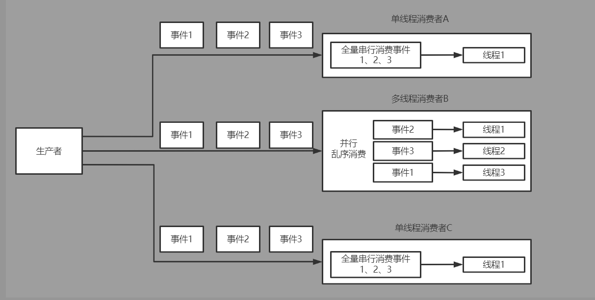

# MyDisruptor V3版本介绍
在v2版本的MyDisruptor实现多消费者、消费者组间依赖功能后。按照计划，v3版本的MyDisruptor需要支持多线程消费者的功能。
#####
由于该文属于系列博客的一部分，需要先对之前的博客内容有所了解才能更好地理解本篇博客
* v1版本博客：[从零开始实现lmax-Disruptor队列（一）RingBuffer与单生产者、单消费者工作原理解析](https://www.cnblogs.com/xiaoxiongcanguan/p/16318972.html)
* v2版本博客：[从零开始实现lmax-Disruptor队列（二）多消费者、消费者组间消费依赖原理解析](https://www.cnblogs.com/xiaoxiongcanguan/p/16361197.html)
# MyDisruptor支持多线程消费者
* 之前的版本中我们已经实现了单线程消费者串行的消费，但在某些场景下我们需要更快的消费速度，所以disruptor也提供了多线程的消费者机制。  
* 多线程消费者对外功能上和单线程消费者基本一样，也是全量的消费从序列0到序列N的完整事件，但内部确是并行乱序消费的。具体哪个线程消费

# MyDisruptor v3版本demo解析
# 总结

