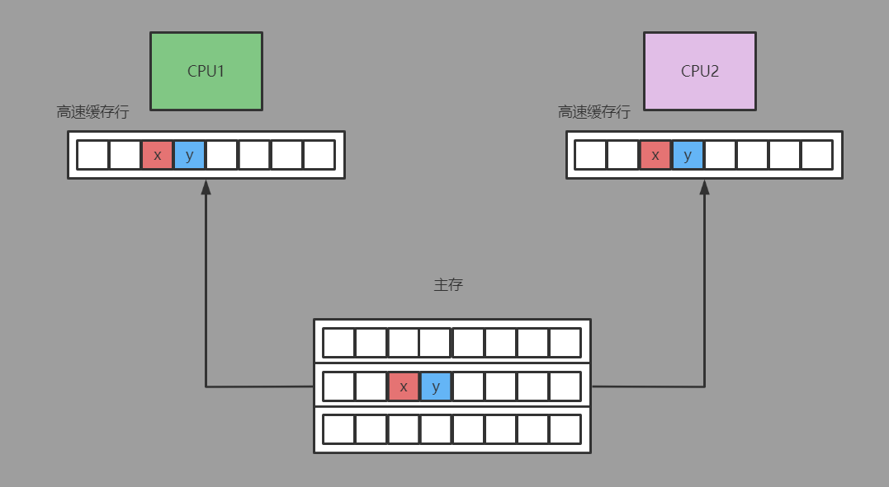
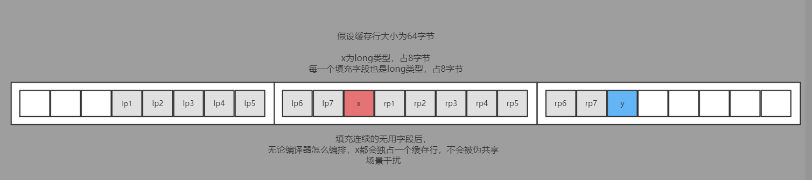

# MyDisruptor V6版本介绍
在v5版本的MyDisruptor实现DSL风格的API后。按照计划，v6版本的MyDisruptor作为最后一个版本，需要对MyDisruptor进行最终的一些细节优化。
v6版本一共做了三处优化：
* 解决伪共享问题
* 支持消费者线程优雅停止
* 生产者序列器中维护消费者序列集合的数据结构由ArrayList优化为数组Array类型(减少ArrayList在get操作时额外的rangeCheck检查)
#####
由于该文属于系列博客的一部分，需要先对之前的博客内容有所了解才能更好地理解本篇博客
* v1版本博客：[从零开始实现lmax-Disruptor队列（一）RingBuffer与单生产者、单消费者工作原理解析](https://www.cnblogs.com/xiaoxiongcanguan/p/16318972.html)
* v2版本博客：[从零开始实现lmax-Disruptor队列（二）多消费者、消费者组间消费依赖原理解析](https://www.cnblogs.com/xiaoxiongcanguan/p/16361197.html)
* v3版本博客：[从零开始实现lmax-Disruptor队列（三）多线程消费者WorkerPool原理解析](https://www.cnblogs.com/xiaoxiongcanguan/p/16386982.html)
* v4版本博客：[从零开始实现lmax-Disruptor队列（四）多线程生产者MultiProducerSequencer原理解析](https://www.cnblogs.com/xiaoxiongcanguan/p/16448674.html)
* v5版本博客：[从零开始实现lmax-Disruptor队列（五）Disruptor DSL风格API原理解析](https://www.cnblogs.com/xiaoxiongcanguan/p/16479148.html)
# 伪共享问题（FalseSharing）原理详解
**在第一篇博客中我们就已经介绍过伪共享问题了，这里复制原博客内容如下:**  
_现代的CPU都是多核的，每个核心都拥有独立的高速缓存。高速缓存由固定大小的缓存行组成（通常为32个字节或64个字节）。_  
_CPU以缓存行作为最小单位读写，且一个缓存行通常会被多个变量占据（例如32位的引用指针占4字节，64位的引用指针占8个字节）。_    
_这样的设计导致了一个问题：即使缓存行上的变量是无关联的（比如不属于同一个对象），但只要缓存行上的某一个共享变量发生了变化，则整个缓存行都会进行缓存一致性的同步。_  
_而CPU间缓存一致性的同步是有一定性能损耗的，能避免则尽量避免。这就是所谓的“**伪共享**”问题。_    
_disruptor通过对队列中一些关键变量进行了缓存行的填充，避免其因为不相干的变量读写而无谓的刷新缓存，解决了伪共享的问题。_
### 举例展示伪共享问题对性能的影响
* 假设存在一个Point对象，其中有两个volatile修饰的long类型字段，x和y。  
  有两个线程并发的访问一个Point对象，但其中一个线程1只读写x字段，而另一个线程2只读写y字段。
##### 存在伪共享问题的demo  
```java
public class Point {
    public volatile int x;
    public volatile int y;

    public Point(int x, int y) {
        this.x = x;
        this.y = y;
    }
}
```
```java
import java.util.concurrent.CountDownLatch;
import java.util.concurrent.SynchronousQueue;
import java.util.concurrent.ThreadPoolExecutor;
import java.util.concurrent.TimeUnit;

public class FalseSharingDemo {

    public static void main(String[] args) throws InterruptedException {
        ThreadPoolExecutor executor = new ThreadPoolExecutor(2, 2, 60L, TimeUnit.SECONDS, new SynchronousQueue<>());
        CountDownLatch countDownLatch = new CountDownLatch(2);
        Point point = new Point(1,2);
        long start = System.currentTimeMillis();
        executor.execute(()->{
            // 线程1 x自增1亿次
            for(int i=0; i<100000000; i++){
                point.x++;
            }
            countDownLatch.countDown();
        });

        executor.execute(()->{
            // 线程2 y自增1亿次
            for(int i=0; i<100000000; i++){
                point.y++;
            }
            countDownLatch.countDown();
        });

        countDownLatch.await();
        long end = System.currentTimeMillis();
        System.out.println("testNormal 耗时=" + (end-start));
        executor.shutdown();
    }
}
```
* 两个线程各自独立访问两个不同的数据，但x和y是连续分布的，因此大概率读写时会被放到同一个高速缓存行中，
  由于volatile变量修饰的原因，线程1对x线程的修改会对当前缓存行进行触发高速缓存间同步进行强一致地写，使得线程2中x、y字段所在CPU的高速缓存行失效，被迫重新读取主存中最新的数据。  
  但实际上线程1读写x和线程2读写y是完全不相关的，线程1与线程2在实际业务中并不需要共享同一片内存空间，因此强一致的高速缓存行同步完全是画蛇添足，只会降低性能。

* 需要注意的是，伪共享问题绝大多数情况下是出现在不同对象之间的，例如线程1会访问对象A中的volatile变量aaa，而线程2会访问另一个对象B中的volatile变量bbb。
  但恰好对象A的aaa属性和对象B的bbb属性的地址被编译器安排设置在了一起，且在读写时被加载到同一个缓存行中，这便是实际上最常见的伪共享场景。  
  因此这里举的例子其实并不恰当，只是为了方便才拿同一个对象里的不同字段伪共享举例。
* 解决伪共享问题的方法是做缓存行的填充，简单来说就是通过在需要避免伪共享的volatile字段集合前后填充无用的padding字段，让编译器在编排变量地址时保证其不会被其它线程在访问不相关的变量时所影响。
  无论编译器怎样编排，被包裹的volatile变量都不会被其它无关的变量访问而被迫进行强一致的同步缓存。

##### 通过填充无用字段解决伪共享问题demo
```java
public class PointNoFalseSharing {

    private long lp1, lp2, lp3, lp4, lp5, lp6, lp7;
    public volatile long x;
    private long rp1, rp2, rp3, rp4, rp5, rp6, rp7;

    public volatile long y;

    public PointNoFalseSharing(int x, int y) {
        this.x = x;
        this.y = y;
    }
}
```  
```java
public class NoFalseSharingDemo {

    public static void main(String[] args) throws InterruptedException {
        ThreadPoolExecutor executor = new ThreadPoolExecutor(2, 2, 60L, TimeUnit.SECONDS, new SynchronousQueue<>());
        CountDownLatch countDownLatch = new CountDownLatch(2);
        PointNoFalseSharing point = new PointNoFalseSharing(1,2);
        long start = System.currentTimeMillis();
        executor.execute(()->{
            // 线程1 x自增1亿次
            for(int i=0; i<100000000; i++){
                point.x++;
            }
            countDownLatch.countDown();
        });

        executor.execute(()->{
            // 线程2 y自增1亿次
            for(int i=0; i<100000000; i++){
                point.y++;
            }
            countDownLatch.countDown();
        });

        countDownLatch.await();
        long end = System.currentTimeMillis();
        System.out.println("testNoFalseSharing 耗时=" + (end-start));
        executor.shutdown();
    }
}
```
* 感兴趣的读者可以把上述存在伪共享问题和解决了伪共享问题的demo分别执行下看看。    
  **在我的机器上，两个线程在对x、y分别自增1亿次的场景下，存在伪共享问题的示例代码FalseSharingDemo比解决了伪共享问题示例代码NoFalseSharingDemo要慢3到4倍。**
# disruptor中伪共享问题的解决
* disruptor中对三个关键组件的全部或部分属性进行了缓存行的填充，分别是Sequence、RingBuffer和SingleProducerSequencer。  
  这三个组件有两大特征：只会被单个线程写、会被大量其它线程频繁的读，令它们避免出现伪共享问题在高并发场景下对性能有很大提升。
* MySingleProducerSequencer中很多属性，但只有nextValue和cachedConsumerSequenceValue被填充字段包裹起来，其主要原因是只有这两个字段会被生产者频繁的更新。
##### MySequence解决伪共享实现 
```java
/**
 * 序列号对象（仿Disruptor.Sequence）
 *
 * 由于需要被生产者、消费者线程同时访问，因此内部是一个volatile修饰的long值
 * */
public class MySequence {

    /**
     * 解决伪共享 左半部分填充
     * */
    private long lp1, lp2, lp3, lp4, lp5, lp6, lp7;

    /**
     * 序列起始值默认为-1，保证下一个序列恰好是0（即第一个合法的序列号）
     * */
    private volatile long value = -1;

    /**
     * 解决伪共享 右半部分填充
     * */
    private long rp1, rp2, rp3, rp4, rp5, rp6, rp7;

    private static final Unsafe UNSAFE;
    private static final long VALUE_OFFSET;

    static {
        try {
            UNSAFE = UnsafeUtil.getUnsafe();
            VALUE_OFFSET = UNSAFE.objectFieldOffset(MySequence.class.getDeclaredField("value"));
        }
        catch (final Exception e) {
            throw new RuntimeException(e);
        }
    }

    // 注意：省略了方法代码
}
```
##### MyRingBuffer解决伪共享实现
```java
/**
 * 环形队列（仿Disruptor.RingBuffer）
 * */
public class MyRingBuffer<T> {

  /**
   * 解决伪共享 左半部分填充
   * */
  protected long lp1, lp2, lp3, lp4, lp5, lp6, lp7;

  private final T[] elementList;
  private final MyProducerSequencer myProducerSequencer;
  private final int ringBufferSize;
  private final int mask;

  /**
   * 解决伪共享 右半部分填充
   * */
  protected long rp1, rp2, rp3, rp4, rp5, rp6, rp7;

  // 注意：省略了方法代码
}
```
##### MySingleProducerSequencer解决伪共享实现
```java
/**
 * 单线程生产者序列器（仿Disruptor.SingleProducerSequencer）
 * 只支持单消费者的简易版本（只有一个consumerSequence）
 *
 * 因为是单线程序列器，因此在设计上就是线程不安全的
 * */
public class MySingleProducerSequencer implements MyProducerSequencer {

   /**
   * 生产者序列器所属ringBuffer的大小
   * */
  private final int ringBufferSize;

  /**
   * 当前已发布的生产者序列号
   * （区别于nextValue）
   * */
  private final MySequence currentProducerSequence = new MySequence();

  /**
   * 生产者序列器所属ringBuffer的消费者序列集合
   * */
  private volatile MySequence[] gatingConsumerSequences = new MySequence[0];

  private final MyWaitStrategy myWaitStrategy;

  /**
   * 解决伪共享 左半部分填充
   * */
  private long lp1, lp2, lp3, lp4, lp5, lp6, lp7;

  /**
   * 当前已申请的序列(但是是否发布了，要看currentProducerSequence)
   *
   * 单线程生产者内部使用，所以就是普通的long，不考虑并发
   * */
  private long nextValue = -1;

  /**
   * 当前已缓存的消费者序列
   *
   * 单线程生产者内部使用，所以就是普通的long，不考虑并发
   * */
  private long cachedConsumerSequenceValue = -1;

  /**
   * 解决伪共享 右半部分填充
   * */
  private long rp1, rp2, rp3, rp4, rp5, rp6, rp7;

  // 注意：省略了方法代码
}
```  
* 对象填充多余字段避免伪共享问题，提高了性能的同时，也需要注意其可能大幅增加了对象所占用的内存空间。
  在disruptor中因为Sequence,RingBuffer,SingleProducerSequencer这三个数据结构都是被线程频繁访问的，但实际的数量却十分有限(正比于生产者、消费者的总数)，所以这个问题并不严重。
* 填充缓存行的方法既可以像disruptor一样，手动的设置填充字段，也可以使用jdk提供的Contended注解来告诉编译器进行缓冲行的填充，限于篇幅就不再继续展开了。
### 为什么和SingleProducerSequencer类似的MultiProducerSequencer不需要解决伪共享问题？
* 因为多线程生产者序列器中和nextValue、cachedConsumerSequenceValue等价的属性就是需要在多个生产者线程间共享的，因此确实需要频繁的在多个CPU核心的高速缓存行间进行同步。
  这种场景是实实在在的共享场景，而不是伪共享场景，因此也就不存在伪共享问题了。
# 支持消费者线程优雅停止详解
截止MyDisruptor的v5版本，消费者线程都是通过一个永不停止的while循环进行工作的，除非强制杀死线程，否则无法令消费者线程关闭，而这无疑是不优雅的。
### 实现外部通知消费者线程自行终止
为此，disruptor实现了令消费者线程主动停止的机制。
* 具体思路是在消费者线程内部维护一个用于标识是否需要继续运行的标识running，默认是运行中，但外部可以去修改标识的状态（halt方法），将其标识为停止。
* 消费者主循环时每次都检查一下该状态，如果标识是停止，则抛出AlertException异常。主循环中捕获该异常，然后通过一个break跳出主循环，主动地关闭。
##### 实现了优雅停止功能的单线程消费者
```java
/**
 * 单线程消费者（仿Disruptor.BatchEventProcessor）
 * */
public class MyBatchEventProcessor<T> implements MyEventProcessor{

    private final MySequence currentConsumeSequence = new MySequence(-1);
    private final MyRingBuffer<T> myRingBuffer;
    private final MyEventHandler<T> myEventConsumer;
    private final MySequenceBarrier mySequenceBarrier;
    private final AtomicBoolean running = new AtomicBoolean();

    public MyBatchEventProcessor(MyRingBuffer<T> myRingBuffer,
                                 MyEventHandler<T> myEventConsumer,
                                 MySequenceBarrier mySequenceBarrier) {
        this.myRingBuffer = myRingBuffer;
        this.myEventConsumer = myEventConsumer;
        this.mySequenceBarrier = mySequenceBarrier;
    }

    @Override
    public void run() {
        if (!running.compareAndSet(false, true)) {
            throw new IllegalStateException("Thread is already running");
        }
        this.mySequenceBarrier.clearAlert();

        // 下一个需要消费的下标
        long nextConsumerIndex = currentConsumeSequence.get() + 1;

        // 消费者线程主循环逻辑，不断的尝试获取事件并进行消费（为了让代码更简单，暂不考虑优雅停止消费者线程的功能）
        while(true) {
            try {
                long availableConsumeIndex = this.mySequenceBarrier.getAvailableConsumeSequence(nextConsumerIndex);

                while (nextConsumerIndex <= availableConsumeIndex) {
                    // 取出可以消费的下标对应的事件，交给eventConsumer消费
                    T event = myRingBuffer.get(nextConsumerIndex);
                    this.myEventConsumer.consume(event, nextConsumerIndex, nextConsumerIndex == availableConsumeIndex);
                    // 批处理，一次主循环消费N个事件（下标加1，获取下一个）
                    nextConsumerIndex++;
                }

                // 更新当前消费者的消费的序列（lazySet，不需要生产者实时的强感知刷缓存性能更好，因为生产者自己也不是实时的读消费者序列的）
                this.currentConsumeSequence.lazySet(availableConsumeIndex);
                LogUtil.logWithThreadName("更新当前消费者的消费的序列:" + availableConsumeIndex);
            } catch (final MyAlertException ex) {
                LogUtil.logWithThreadName("消费者MyAlertException" + ex);

                // 被外部alert打断，检查running标记
                if (!running.get()) {
                    // running == false, break跳出主循环，运行结束
                    break;
                }
            } catch (final Throwable ex) {
                // 发生异常，消费进度依然推进（跳过这一批拉取的数据）（lazySet 原理同上）
                this.currentConsumeSequence.lazySet(nextConsumerIndex);
                nextConsumerIndex++;
            }
        }
    }

    @Override
    public MySequence getCurrentConsumeSequence() {
        return this.currentConsumeSequence;
    }

    @Override
    public void halt() {
        // 当前消费者状态设置为停止
        running.set(false);

        // 唤醒消费者线程（令其能立即检查到状态为停止）
        this.mySequenceBarrier.alert();
    }

    @Override
    public boolean isRunning() {
        return this.running.get();
    }
}
```
##### 实现了优雅停止功能多线程消费者
```java
/**
 * 多线程消费者工作线程 （仿Disruptor.WorkProcessor）
 * */
public class MyWorkProcessor<T> implements MyEventProcessor{

    private final MySequence currentConsumeSequence = new MySequence(-1);
    private final MyRingBuffer<T> myRingBuffer;
    private final MyWorkHandler<T> myWorkHandler;
    private final MySequenceBarrier sequenceBarrier;
    private final MySequence workGroupSequence;

    private final AtomicBoolean running = new AtomicBoolean(false);


    public MyWorkProcessor(MyRingBuffer<T> myRingBuffer,
                           MyWorkHandler<T> myWorkHandler,
                                MySequenceBarrier sequenceBarrier,
                                MySequence workGroupSequence) {
        this.myRingBuffer = myRingBuffer;
        this.myWorkHandler = myWorkHandler;
        this.sequenceBarrier = sequenceBarrier;
        this.workGroupSequence = workGroupSequence;
    }

    @Override
    public MySequence getCurrentConsumeSequence() {
        return currentConsumeSequence;
    }

    @Override
    public void halt() {
        // 当前消费者状态设置为停止
        running.set(false);

        // 唤醒消费者线程（令其能立即检查到状态为停止）
        this.sequenceBarrier.alert();
    }

    @Override
    public boolean isRunning() {
        return this.running.get();
    }

    @Override
    public void run() {
        if (!running.compareAndSet(false, true)) {
            throw new IllegalStateException("Thread is already running");
        }
        this.sequenceBarrier.clearAlert();

        long nextConsumerIndex = this.currentConsumeSequence.get();
        // 设置哨兵值，保证第一次循环时nextConsumerIndex <= cachedAvailableSequence一定为false，走else分支通过序列屏障获得最大的可用序列号
        long cachedAvailableSequence = Long.MIN_VALUE;

        // 最近是否处理过了序列
        boolean processedSequence = true;

        while (true) {
            try {
                if(processedSequence) {
                    // 争抢到了一个新的待消费序列，但还未实际进行消费（标记为false）
                    processedSequence = false;

                    // 如果已经处理过序列，则重新cas的争抢一个新的待消费序列
                    do {
                        nextConsumerIndex = this.workGroupSequence.get() + 1L;
                        // 由于currentConsumeSequence会被注册到生产者侧，因此需要始终和workGroupSequence worker组的实际sequence保持协调
                        // 即当前worker的消费序列currentConsumeSequence = 当前消费者组的序列workGroupSequence
                        this.currentConsumeSequence.lazySet(nextConsumerIndex - 1L);
                        // 问题：只使用workGroupSequence，每个worker不维护currentConsumeSequence行不行？
                        // 回答：这是不行的。因为和单线程消费者的行为一样，都是具体的消费者eventHandler/workHandler执行过之后才更新消费者的序列号，令其对外部可见（生产者、下游消费者）
                        // 因为消费依赖关系中约定，对于序列i事件只有在上游的消费者消费过后（eventHandler/workHandler执行过），下游才能消费序列i的事件
                        // workGroupSequence主要是用于通过cas协调同一workerPool内消费者线程序列争抢的，对外的约束依然需要workProcessor本地的消费者序列currentConsumeSequence来控制

                        // cas更新，保证每个worker线程都会获取到唯一的一个sequence
                    } while (!workGroupSequence.compareAndSet(nextConsumerIndex - 1L, nextConsumerIndex));
                }else{
                    // processedSequence == false(手头上存在一个还未消费的序列)
                    // 走到这里说明之前拿到了一个新的消费序列，但是由于nextConsumerIndex > cachedAvailableSequence，没有实际执行消费逻辑
                    // 而是被阻塞后返回获得了最新的cachedAvailableSequence，重新执行一次循环走到了这里
                    // 需要先把手头上的这个序列给消费掉，才能继续拿下一个消费序列
                }

                // cachedAvailableSequence只会存在两种情况
                // 1 第一次循环，初始化为Long.MIN_VALUE，则必定会走到下面的else分支中
                // 2 非第一次循环，则cachedAvailableSequence为序列屏障所允许的最大可消费序列

                if (cachedAvailableSequence >= nextConsumerIndex) {
                    // 争抢到的消费序列是满足要求的（小于序列屏障值，被序列屏障允许的），则调用消费者进行实际的消费

                    // 取出可以消费的下标对应的事件，交给eventConsumer消费
                    T event = myRingBuffer.get(nextConsumerIndex);
                    this.myWorkHandler.consume(event);

                    // 实际调用消费者进行消费了，标记为true.这样一来就可以在下次循环中cas争抢下一个新的消费序列了
                    processedSequence = true;
                } else {
                    // 1 第一次循环会获取当前序列屏障的最大可消费序列
                    // 2 非第一次循环，说明争抢到的序列超过了屏障序列的最大值，等待生产者推进到争抢到的sequence
                    cachedAvailableSequence = sequenceBarrier.getAvailableConsumeSequence(nextConsumerIndex);
                }
            } catch (final MyAlertException ex) {
                // 被外部alert打断，检查running标记
                if (!running.get()) {
                    // running == false, break跳出主循环，运行结束
                    break;
                }
            } catch (final Throwable ex) {
                // 消费者消费时发生了异常，也认为是成功消费了，避免阻塞消费序列
                // 下次循环会cas争抢一个新的消费序列
                processedSequence = true;
            }
        }
    }
}
```
```java
/**
 * 多线程消费者（仿Disruptor.WorkerPool）
 * */
public class MyWorkerPool<T> {

  private final AtomicBoolean started = new AtomicBoolean(false);
  private final MySequence workSequence = new MySequence(-1);
  private final MyRingBuffer<T> myRingBuffer;
  private final List<MyWorkProcessor<T>> workEventProcessorList;
  
  public void halt() {
    for (MyWorkProcessor<?> processor : this.workEventProcessorList) {
      // 挨个停止所有工作线程  
      processor.halt();
    }

    started.set(false);
  }

  public boolean isRunning(){
    return this.started.get();
  }
  
  // 注意：省略了无关代码
}
```
##### 实现了优雅停止功能的序列屏障
* 在修改标识状态为停止的halt方法中，消费者线程可能由于等待生产者继续生产而处于阻塞状态（例如BlockingWaitStrategy），
  所以还需要通过消费者维护的序列屏障SequenceBarrier的alert方法来尝试着唤醒消费者。
```java
/**
 * 序列栅栏（仿Disruptor.SequenceBarrier）
 * */
public class MySequenceBarrier {

    private final MyProducerSequencer myProducerSequencer;
    private final MySequence currentProducerSequence;
    private volatile boolean alerted = false;
    private final MyWaitStrategy myWaitStrategy;
    private final MySequence[] dependentSequencesList;

    public MySequenceBarrier(MyProducerSequencer myProducerSequencer, MySequence currentProducerSequence,
                             MyWaitStrategy myWaitStrategy, MySequence[] dependentSequencesList) {
        this.myProducerSequencer = myProducerSequencer;
        this.currentProducerSequence = currentProducerSequence;
        this.myWaitStrategy = myWaitStrategy;

        if(dependentSequencesList.length != 0) {
            this.dependentSequencesList = dependentSequencesList;
        }else{
            // 如果传入的上游依赖序列为空，则生产者序列号作为兜底的依赖
            this.dependentSequencesList = new MySequence[]{currentProducerSequence};
        }
    }

    /**
     * 获得可用的消费者下标（disruptor中的waitFor）
     * */
    public long getAvailableConsumeSequence(long currentConsumeSequence) throws InterruptedException, MyAlertException {
        // 每次都检查下是否有被唤醒，被唤醒则会抛出MyAlertException代表当前消费者要终止运行了
        checkAlert();

        long availableSequence = this.myWaitStrategy.waitFor(currentConsumeSequence,currentProducerSequence,dependentSequencesList,this);

        if (availableSequence < currentConsumeSequence) {
            return availableSequence;
        }

        // 多线程生产者中，需要进一步约束（于v4版本新增）
        return myProducerSequencer.getHighestPublishedSequence(currentConsumeSequence,availableSequence);
    }

    /**
     * 唤醒可能处于阻塞态的消费者
     * */
    public void alert() {
        this.alerted = true;
        this.myWaitStrategy.signalWhenBlocking();
    }

    /**
     * 重新启动时，清除标记
     */
    public void clearAlert() {
        this.alerted = false;
    }

    /**
     * 检查当前消费者的被唤醒状态
     * */
    public void checkAlert() throws MyAlertException {
        if (alerted) {
            throw MyAlertException.INSTANCE;
        }
    }
}
```  
##### 由disruptor对外暴露的halt方法，停止当前所有消费者线程
* disruptor类提供了一个halt方法，其基于组件提供的halt机制将所有注册的消费者线程全部关闭。
* consumerInfo抽象了单线程/多线程消费者，其子类的halt方法内部会调用对应消费者的halt方法将对应消费者终止。
```java
/**
 * disruptor dsl(仿Disruptor.Disruptor)
 * */
public class MyDisruptor<T> {

  private final MyRingBuffer<T> ringBuffer;
  private final Executor executor;
  private final MyConsumerRepository<T> consumerRepository = new MyConsumerRepository<>();
  private final AtomicBoolean started = new AtomicBoolean(false);
  
  /**
   * 启动所有已注册的消费者
   * */
  public void start(){
    // cas设置启动标识，避免重复启动
    if (!started.compareAndSet(false, true)) {
      throw new IllegalStateException("Disruptor只能启动一次");
    }

    // 遍历所有的消费者，挨个start启动
    this.consumerRepository.getConsumerInfos().forEach(
            item->item.start(this.executor)
    );
  }

  /**
   * 停止注册的所有消费者
   * */
  public void halt() {
    // 遍历消费者信息列表，挨个调用halt方法终止
    for (final MyConsumerInfo consumerInfo : this.consumerRepository.getConsumerInfos()) {
      consumerInfo.halt();
    }
  }
  
  // 注意：省略了无关代码
}
```
### 优雅停止消费者线程
# 消费者序列集合的数据结构由ArrayList优化为数组详解
  todo 待完善